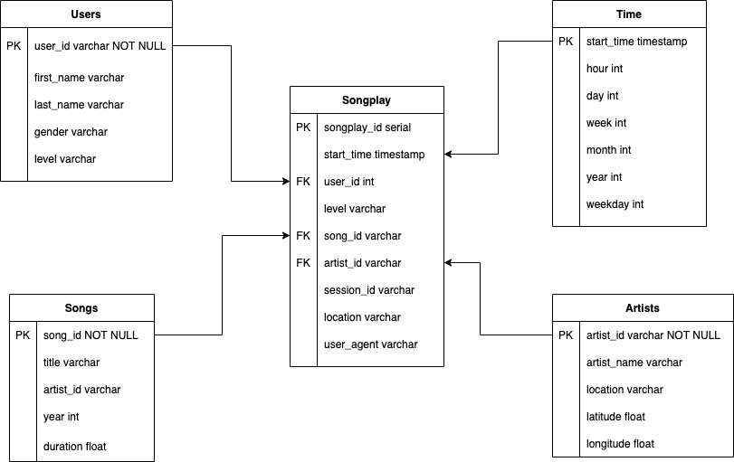

<h1>Project1</h1>

## Objective
1. Do the modeling with the data of the startup company Sparkify in order to be able to analyze the songs what users are listening to.
2. By data modeling, tables is created into Postgres database to optimize queries on song play analysis.
3. ETL pipeline is created to insert data that was originall log and medatada from the app that was stored as JSON format.

## Data modeling with Star schema
The tables are designed as star schema as below so that it is flexible to analyze.

* Fact table: Songplay
* Dimension table: Users, Songs, Artists, Time

## DATASETS
* Subset of Million [Song Dataset](http://millionsongdataset.com/)
* Logdata generated by an [Event Log Simulator](https://github.com/Interana/eventsim)

## Files included in the REPO:
1. log_data: consists of files in JSON format generated by an event simulator based on the songs in the dataset. These simulate activity logs from a music streaming app, they are partitioned by year and month.
2. song_data: consists of files in JSON format includes metadata about a song and the artist of that song. The files are seperated by the first three letters of each song's track ID. 

* etl.ipynb which contains detailed steps of the ETL Process used to process the files and insert the data in the  tables
* test.ipynb which have some test SELECT statements to show the data being successfully inserted to the table and includes the example queries for the database.
* sql_queries.py that includes the DB create & insert statements separeted in their own file for modularity
* create_tables.py that automatically drops the tables if they already exists and creates the tables as defined in the sql_queries module
* etl.py that contains the main program and manages the file processing needed for reading the files in JSON formats and inserting the data to the DB tables that was defined by the create_tables.py

## STEPS TO RUN THE PROJECT
1. Execute the "python create_tables.py" file in the Terminal to create all the DB tables.
2. Execute the "python etl.py" file in the Terminal to insert all records in the tables.
3. Open "test.ipynb" and run each cell from the top. Check the results of each table if the table is created and the data is inserted properly.

### EXAMPLE QUERIES(included in test.ipynb)
#### To know how many times each gender had listened to songs.

	SELECT u.gender, count(s.songplay_id)
	 FROM songplays s
	 JOIN users u
	 ON s.user_id = u.user_id
	 GROUP BY u.gender

#### Each artist's song played frequency
	
	SELECT year, month, artist_name, count(songplay_id) cnt
	 FROM songplays s
	 JOIN time t
	 ON s.start_time = t.start_time
	 JOIN artists a
	 ON s.aritst_id = a.aritst_id
	 GROUP BY t.year, t.month, a.aritst_name
	 

